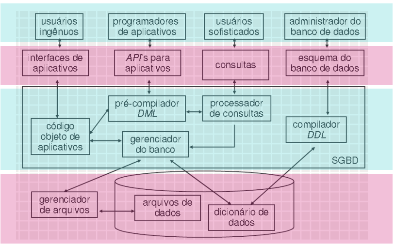

# CONCEITOS DE BANCO DE DADOS

## Dado

- **Fato do mundo real** que está registrado.
- São fatos em uma forma primária, que podem ser armazenados em algum meio.
Ex: Endereço, Data.
  - *Dado Atômico* - Elementos de dados que representam o nível mais baixo de detalhamento. Então, campos não-atômicos são aqueles que podem ser subdivididos em mais de um campo, pois eles escondem detalhes, como por exemplo o nome de uma pessoa, que contém o primeiro nome e sobrenome.

## Informação

- **Fato útil** que pode ser extraído **direta ou indiretamente** a partir dos dados.
- São os fatos organizados de maneira a produzir um significado, ou seja, dados colocados em contexto.
EX: Endereço de entrega, Idade.

## Banco de dados (DB - Database ou BD Banco de dados)

- **Coleção organizada de dados, inter-relacionados e persistentes** que representa um subconjunto dos fatos presente em um domínio de aplicação (universo de discurso), onde são armazenados em meio eletrônico, permitindo efetuar consultas que retornam os dados armazenados, de diversas maneiras distintas.
- Esses dados são organizados de modo a modelar aspectos do mundo real, para que seja possível efetuar processamento que gere informações relevantes para os usuários a partir desses dados.
- Arquivo(s) armazenado(s) em algum meio, gerenciado por algum sistema específico de software, e utilizado por aplicações que acessam os dados armazenados.
- O mesmo que **base de dados (Database)**
- Banco de dados = instância de dado + meta-dados.
  - *Instância de dados* = Dado propriamente.
  - *Meta-dados* = Dicionário de dados
    - Esquema da base de dados;
    - Acessado através de linguagens de definição de dados;
- **Características e Funcionalidades**:
  - *Controle de Redundância*: Evitar duplicidade dos dados;
  - *Múltiplas Visões dos dados*: Exigir ao usuário os dados / informações de formas distintas dependendo de quem e como quer ver esses dados / informações;
  - *Controle de Concorrência*: É o gerenciamento de acessos e alterações que os usuários fazem;
  - *Backup e Restauração*;
  - *Autentificação e Autorização de acesso*;
  - *Restrições de integridade*: Faz com que os dados não sejam simplesmente adicionados, mas sim criando restrições/condições para garantir a sua integridade ;

- Sistema de Banco de Dados:
[Exemplos](./img/sistema-db.png)

## SGBD / DBMS

- **Sistema de Gerenciamento e Banco de Dados / DataBase Management System.**
- Conjunto de softwares e ferramentas que permite o acesso, criação e gerência da base de dados, além de fazer a interação entre aplicações, usuários e banco de dados.
- Permite realizar consultas e enviar comandos ao BD.
- São projetados para gerenciar grandes grupos de informações;
- Têm o poder de garantir a **Integridade dos dados** mesmo com vários usuários realizando alterações, além de conseguir isolar usuários dos detalhes mais internos do banco de dados, a chamada **abstração de dados**, que é um dos principais objetivos do sistema;
- **NÃO** é o banco de dados em si, mas um sistema de acesso.
- Existem os softwares relacionais (RDBMS - Relational DataBase Management System):
  - Oracle Database;
  - MySQL Server;
  - Microsoft SQL Server;
  - IBM DB2.
- e os não relacionais, que trabalham com NoSQL (DBMS - DataBase Management System)
  - MongoDB
  - Redis
  - Cassandra
- Já a sua arquitetura consiste em (respectivamente):
  - Interface;
  - Processamento de consultas;
  - Processamento de transações;
  - Acesso a Arquivos;
  - Base de dados;
- **Instância**: Coleção de informações armazenadas (mudam com frequência);
- **Esquema**: Projeto geral do banco de dados (não mudam com frequência);
  - **Independência dos dados**: É a modificação do esquema dos dados em um nível sem afetar a definição do esquema em um nível mais alto.  
  
- Existem 2 tipos de independência:
  - *Física de dados*: Habilidade de modificar o esquema físico sem a necessidade de reescrever os programa aplicativo. Estas modificações são necessárias para melhorar o desempenho;
  - *Lógica de dados*: Habilidade de modificar o esquema conceitual sem a necessidade de reescrever os programas aplicativos. Estas modificações são necessárias quando a estrutura lógica é alterada. EX: adição de um novo atributo. Ela é a mais difícil de ser alcançada, pois os programas são bastante dependentes de estrutura lógica dos dados que eles acessam.
- **Tipos de Usuários**:
  - *Programadores de aplicativos/Projetista*: São os usuários que escrevem os programas de aplicação através da DML;
  - *Usuários de alto nível*:  Interagem com o sistema sem escrever programas;
  - *Usuários especializados (especialistas)*: Escrevem aplicativos especializados como sistemas especialistas;
  - *Usuários ingênuos*: Interagem com o sistema invocando os programas aplicativos;
  - *Administrador do banco de dados (DBA - DataBase Administrator)*: Tem o controle central dos dados e dos programas de acesso aos dados;
    - Funções do Administrador do banco de dados:
      - Definição do esquema;
      - Definição de estruturas de armazenamento e métodos de acesso;
      - Modificação de esquema e de organização física;
      - Concessão de autorização para acesso aos dados;
      - Especificação de restrições de integridade;

### Backup e Restauração

- **Operações de extrema importância em um BD.**
- Backup é uma cópia de segurança de dados que pode ser utilizada para realizar REstauração em caso de perda ou corrupção dos dados originais.
- Importante não apenas no contexto de BD, mas para toda e qualquer forma de armazenamento de dados / arquivos.
- Deve ser realizado periodicamente, e o melhor cenário é nunca precisar realizar a restauração.

## Sistemas de arquivos

- Seria o inverso do sistema de banco de dados, nele os dados tem vários problemas:
  - O dados pode aparecer várias vezes na base de dados;
  - Redundância não controlada;
  - Difícil implementação;
  - Muito propicio a falhas;
  - Segurança frágil;
  - Tamanho de memória;

## Eco-sistema do Banco de Dados

- Gerenciador de arquivos;
- Gerenciados do banco de dados;
- Processador de consultas;
- Pré-compilador da DML;
- Compilador da DDL
  - Arquivos de dados;
  - Dicionário de dados;
  - Índices;

- Transações
  - Utilizadas para controlar a integridade dos dados no Banco de dados;

- Otimizador de Consultas
  - Escolhe a forma mais eficiente para execução de uma consulta;

## Views / Visões

- As views(visões), também são chamados de **tabelas virtuais** ou **derivadas**;
- Os dados nessas tabelas virtuais são derivados de tabelas de base de dados ou views previamente definidas;
- Há possíveis limitações nas operações de atualização que podem ser aplicadas à views, mas não existe quaisquer limitações sobre a consulta de uma view.
- Ela é criada quando:
  - Precisamos referenciar determinada(s) tabela(s) com frequência; ou
  - Quando precisamos realizar consultas complexas;
- **Vantagens**:
  - Controle sobre o que o usuário pode ver;
  - Simplifica a consulta;
  - Segurança;
  - Exportação de dados;

## Referências

- Fábio dos Reis, Bóson Treinamentos - [https://youtu.be/2E7crqRI1iE]
- Vania Bogorny, UFSC - [https://www.inf.ufsc.br/~alexandre.goncalves.silva/courses/15s1/ine5223/slides/aula0602.pdf]
- Estratégia Concursos - [https://www.estrategiaconcursos.com.br/blog/conceitos-basicos-de-banco-de-dados/]
- Andre Cortes - Remessa Online, MER e DER, o que são? - [encurtador.com.br/drxQ4]
- Danielle Oliveira - Alura, MER e DER - [https://www.alura.com.br/artigos/mer-e-der-funcoes]
- OPServices, Diferença entre banco de dados - [https://www.opservices.com.br/banco-de-dados/]
- Daniel Maia, Utilizando views, stored procedures e triggers - [https://pt.slideshare.net/maiamg/utilizando-views-stored-procedures-e-triggers]
- Código Fonte TV, SQL // Dicionário do Programador - [https://youtu.be/kMznyI7r2Tc]
