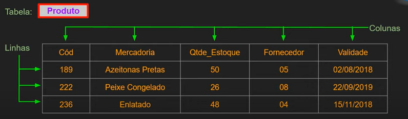

# Modelagem de dados

- **Processo crucial no projeto de um banco de dados.**
- Modelagem de dados é o processo de criação de um modelo de dados para um sistema de informação, com a aplicação de técnicas específicas de modelagem.
- Trata-se de processos para definir e analisar requisitos de dados necessários para suportar processos de negócio com sistemas informatizados em organizações.
- Um modelo de dados fornece uma estrutura para os dados usados em um SI (Sistema de Informação), com definições e formatos específicos
- Permite determinar as tabelas com seus atributos e relacionamentos que comporão o BD (Banco de Dados).
- Elimina redundâncias e dados sem interesse.
- Aplicar regras de negócios de acordo com a real necessidade do cliente.
- Evita problemas futuros com retrabalho e eventual perda de dados.

## Modelos

- Um modelo é uma estrutura que ajuda a comunicar os conceitos que estão na mente do projetista. Podemos usá-lo para tarefas como descrever, analisar, especificar e comunicar ideias.
- O modelo deve possuir detalhes suficientes para que um desenvolvedor consiga construir o banco de dados de acordo com a necessidade do projeto.

## Modelos de Dados

- É uma coleção de ferramentas conceituais para a descrição de dados, relacionamentos, semântica de dados e restrições de consistência.
- Divido em duas formar:
  - **Conceitual**:
    - Entidade-Relacionamento (ER);
    - Orientado a Objetos (OO);
  - **Lógicos**:
    - Redes;        // Modelos antigos
    - Hierárquicos; // dificilmente são utilizados.
    - Orientado a Objetos.
    - *Relacional* - diferente dos outros modelos, ele não usa ponteiros ou ligações, e relaciona registros a partir de valores do registro.
    - Não-Relacional

### Modelos antigos

- **Modelo Hierárquico**: Uma das primeiras formas foi criada pela IBM, onde os dados eram modelados de maneira bem simplista. Neste modelo os dados são organizados de forma hierárquica (lembrando muito um organigrama), com conjuntos de tipos de registros interconectados por meio de ligações.
Um ligação representa uma relação entre dois tipos de registros: pai e filho.
Um esquema no modelo hierárquico é um diagrama de estrutura de árvore.
O acesso aos dados é sempre unidirecional, a partir do pai ao filho.

- **Modelo em Rede**: Uma evolução do hierárquico, onde os dados não teriam superioridade ou inferioridade entre si(ou seja, não tem restrição hierárquica), eles eram ligados em uma forma de rede inteligente.Neste modelo os dados são organizados em tipos e ligações entre dois registros. Tanto o esquema quanto ocorrências de dados são visualizados como um grafo direcionado.

### Modelos atuais

- Apesar de funcionais, os modelos antigos não facilitavam uma coisa que precisaria ser simples, o  **relacionamento**, onde os registros de uma tabela poderiam ter relação com registro de outra tabela, criando assim uma relação entre os dados. Foi então que em junho de 1970, um dos pesquisadores da IBM chamado Edgar F. Codd em um artigo intitulado [A Relational Model of Data for Large Shared Data Banks](https://www.seas.upenn.edu/~zives/03f/cis550/codd.pdf) (Um modelo relacional de dados para grandes bancos de dados compartilhados) propôs um novo modelo:

- **Modelo Relacional**: Nesse novo paradigma, em vez de hierarquias ou ligações de redes, eles teriam relações mais intrínsecas, eles teriam uma **relação**. Ele é fundamentado em lógica e no paradigma da teoria de conjuntos. Neste modelo os dados são separados em entidades, conforme cada assunto, e registrados como atributos dessas entidades. As entidades se relacionam entre si e permitem que os dados sejam armazenados e recuperados de forma rápida e segura.
- No modelo relacional os dados são organizados em coleções de tabelas bidimensionais. Essas tabelas são também chamadas de "relações". A relação é uma forma de se organizar os dados em linhas e colunas.
- Ele é o mais utilizado ultimamente, muito também devido a fácil didática. Os bancos relacionais são a opção ideal para sistemas ERP, CRM ou de gerenciamento financeiro, em que é necessária uma grande consistência de dados.

- *Componentes do Modelo Relacional*:
  - Coleções de objetos ou relações que armazenam os dados;
  - Um conjunto de operadores(comandos) que agem nas relações, produzindo outras relações.
  - Integridade de dados, para precisão e consistência.
-*Banco de dados Relacional*:
  - Nasce a partir do modelo relacional. É uma coleção de relações, que são tabelas bidimensionais, onde os dados são armazenados.
-*Componentes de um banco de dados Relacional*:
  - **Tabela**: Estrutura básica de armazenamento no SGBDR. Armazena todos sos dados necessários sobre algo do mundo real. Também chamada de **Relação**. Um banco de dados relacional pode conter uma ou mais Tabelas. Elas são o resultado do cruzamento de linhas e colunas, sendo assim uma coleção de **linhas (registros)** em um banco de dados relacional, que armazena dados referentes a uma **entidade (assunto)** em particular.  
  - **Tupla**: É um conceito/termo bem especifico no mundo dos bancos de dados, que se refere basicamente a uma **Linha/Registro**, representa todos os dados requeridos por uma determinada ocorrência de entidade em particular ou seja, trata-se de um conjunto de valores de colunas relacionados. Cada linha em uma tabela deve ser identificada por uma chave primária, de modo a não haver duplicação de registros.  
  - **Coluna**: Domínio de valores de um tipo específico (definição técnica). Unidade que armazena um tipo especifico de dado (valor) - ou não armazena nada, com valor nulo. Esta é uma *coluna não-chave* significando que seu valor pode se repetir em outras linhas da tabela. Basicamente seria uma informação que você quer armazenar no banco de dados. As colunas irão fazer a discrição dos atributos da tabela; Dependendo do estágio da modelagem também é conhecida como *Atributo*.  
  - **Relacionamento**: Associação entre as entidades (tabelas), conectadas por chaves primárias e chaves estrangeiras;  
  - **Índices**: - Estrutura de dados empregada para **otimizar a seleção de um conjunto específico de colunas** em um banco de dados relacional. Uma das ferramentas de otimização mais conhecidas e utilizadas pelos desenvolvedores de bancos de dados. Indexação em tabelas **pode aumentar significativamente a performance em consultas** ao banco de dados. Porém, **pode diminuir a velocidade de transações** como *inserts* e *updates*.
  - **Stored Procedures SP**: (Procedimentos Armazenados) São um conjunto de declarações SQL armazenadas no servidor.Eles são utilizados quando:
    - Aplicações clientes são escritas em diferentes linguagens ou trabalham em diferentes plataformas, mas precisam executar as mesas operações de banco de dados;
    - Segurança é primordial. Bancos, por exemplo, utilizam funções e procedimentos armazenados para tordas as operações comuns. Isso provê consistência e segurança, pois cada operação é devidamente registrada.
    - Rotinas armazenadas podem fornecer melhor desempenho pois menos informações precisam ser enviadas entre o cliente e o servidor;
    - A desvantagem é que aumenta-se a carga no servidor de banco de dados;
    - Permitem a criação de uma biblioteca de funções no servidor de banco de dados;  
  - **Triggers**: (Gatilhos) É um objeto do banco de dados que está associado a uma tabela, e é ativado quando um evento particular ocorre na tabela; Principais usos são:
    - Executar verificações de valores; ou
    - Fazer cálculos sobre os valores informados em uma atualização;
  Ele é ativado quando uma declaração INSERT, UPDATE ou DELETE ocorre na tabela associada; O disparo do "gatilho" pode ser configurado para ocorrer antes ou depois do evento de disparo.  

- Esse modelo é interessante pois através de um dado eu posso obter outras informações que estejam relacionadas, desde que esse dado seja bem especificado, diferenciando dos modelos antigos.

> Porém atualmente não há apenas modelos relacionais, existem outras formas de se modelar dados, e cada uma atende uma necessidade, alguns exemplos são:

- **Modelo baseado em Documentos**: É um tipo de banco de dados não relacional projetado para armazenar e consultar dados como documentos do tipo JSON. Ele facilita para que os desenvolvedores armazenem e consultem dados usando o mesmo formato de modelo de documento que usam no código do aplicativo. Devido a sua estrutura ele é capaz de evoluir conforme as necessidades dos aplicativos.

- **Modelo Orientado a Objeto (BDOO)**: Armazenar objetos compartilhados entre diferentes aplicações. Estes meios de armazenamento se tornaram conhecidos com o crescente uso de linguagens Orientada a Objetos. Esse modelo parte de uma premissa simples: o que se persiste são os objetos e, portanto, o seu “estado”, representado pelos atributos. Os atributos seriam equivalentes aos campos – ou colunas – de uma tabela. Já as associações entre objetos (atributos que referenciam outros objetos) podem ser comparadas aos relacionamentos, criados como restrições de integridade referencial (“chaves estrangeiras”). Assim, o correspondente a uma “tabela-filha” em um BDOO seria um atributo que tenha como valor outro objeto.

## Análise de requisitos

- Nesta fase, são realizadas reuniões para coleta de informações, que analisam o que é exigido para o banco de dados a ser criado.
- Os processos de negócio são definidos, e as entidades, atributos e relacionamentos do BD são documentadas.
- A Análise é extremamente importante para o sucesso do projeto do BD.

## MER / ERM

- **Modelo Entidade-Relacionamento / Entity–Relationship Model**
- Criado pelo Dr. Peter Chen, em 1976.
- Trata-se de um modelo conceitual usado para descrever objetos envolvidos no domínio de um sistema a ser construído, incluindo seus atributos e relacionamentos. O MER permite representar de forma abstrata a estrutura que irá construir o banco de dados.
- São diagramas utilizados para projetar Bancos de Dados Relacionais, utilizando como base a relação de objetos reais, e sendo representado por meio de **entidades** e relacionamentos. Criados a partir das especificações do negócio ou narrativas do usuário. Nele ilustramos como os dados são estruturados nos processo de negócios ou para detalhar como os dados são armazenados nos bancos de dados relacionais, além de ilustrar as entidades em um negócio e também relacionamentos entre elas.
Construímos o MER durante a fase de análise no ciclo de vida de desenvolvimento do sistema.
Um MER separa a informação necessária ao negócio das atividades que são realizada no negócio, ou seja, num exemplo de uma loja, o MER irá me auxiliar a saber quais serão os dados serão armazenados das vendas, da loja e do cliente e como esses itens irão se relacionar. Esse modelo é posteriormente refinado com o uso de técnicas específicas, e finalmente implementado em um banco de dados físico.
- Um modelo entidade relacionamento é uma maneira sistemática de descrever e definir um processo de negócio. O processo é modelado como componentes (entidades) que são ligadas umas às outras por relacionamentos que indicam as dependências entre elas.
As entidades podem ter várias propriedades (atributos) que se caracterizam.
Diagramas são criados para representar graficamente entidades, atributos e relacionamentos, denominados Diagrama Entidade-Relacionamento (DER).
- **Modelo** ER (MER): Lista de entidades, atributos e relacionamentos, que traz informações sobre tipos de dados, restrições, descrições de entidades e outras.
- **Diagrama** ER (DER) Representação gráfica associada ao MER (ou parte dele).

### Entidades

As entidades representam um objeto do mundo real e que possuem uma existência independente, como: pessoas, empresa, carro, casa, entre outras coisas que podem ser representadas por uma entidade. Seria algo de importância para um usuário ou organização, algo significativo, sobre o qual devemos possuir informações e que precisa ser representado em um banco de Dados.
Representa um tem, tópico ou conceito de negócio.
Uma entidade pode ter existência física ou abstrata.
Nomeamos as entidades usando substantivos que presentam de forma clara e objetiva sua função.

Cada objeto/ocorrência de uma entidade é denominado de:

**Instância de Entidade**: Uma entidade em si é um descrição da estrutura e forma das ocorrências da entidade, como uma "Receita", ou "planta".
Uma instância de entidade é uma ocorrência específica de uma entidade;

**Regras de Nomeação (Boas práticas)**:

- Colocar os nomes das entidades no singular, mesmo que ela represente varias ocorrências;
- Devem começar com uma letra;
- Não podem ter espaços ou alguns caracteres especiais;
- Os caracteres permitidos são ($, #, _)
- Os nomes de colunas devem ser únicos dentro de uma tabela;
- Os nomes de entidades/  tabelas devem ser únicos dentro do esquema;

Ex: Cliente, Empregado, Livro, Venda, Produto;

Existem três tipos de entidades:

- **Fortes**: Não dependem de outras entidades para existirem;
- **Fracas**: Dependem de outras entidades para existir, ou seja, elas não possuem existência própria ou não possuem atributos próprios para identificação, dependendo assim, dos atributos chave das entidades fortes;
- **Associativas**: são utilizadas quando existe a necessidade de associar uma entidade a um relacionamento;

### Atributos

Os atributos descrevem as propriedades/características das entidades. A entidade pessoa pode ter como atributo o nome, data de nascimento, idade, endereço. Seria algo que descreve ou qualifica uma entidade, com eles podendo ser obrigatórios ou não. Os atributos possuem um tipo de dados (domínio) nome e valor específico. Ex. telefone do cliente, endereço do cliente. Podem ser chamados também de **campos** ou **colunas**. Existem 5 tipos de atributos:

- **Simples/ Atômico**: São indivisíveis, ou seja, são atributos atômicos, que não possuem características especiais. Um exemplo seria o atributo CPF, ele não pode ser dividido em partes menores para formar outros atributos, ele é indivisível.
- **Composto**: Podem ser divididos em partes menores, que representam outros atributos, como o atributo endereço, ele pode ser subdividido em atributos menores, como cidade, estado, rua, CEP. Por esse motivo, não é ideal armazenar o atributo composto inteiro, pois isso dificultará ao se fazer buscas especificais;
- **Multivalorado**: Pode ter um ou N (vários) valores associados a ele, ou seja, conter mais de um valor para um mesmo registro. Por exemplo, o atributo telefone de um cliente, pois o cliente pode ter vários telefones.
- **Derivado**: Dependem de outro atributo ou até mesmo outra entidade para existir, como, por exemplo, o atributo idade e o atributo data de nascimento, para descobrimos a idade de uma pessoa precisamos da sua data de nascimento, então, consideramos o atributo idade como derivado do atributo data de nascimento. No diagrama o Multivalorado **recebe um * antes do seu nome**
- **Determinante**: É utilizado para identificar de forma única uma entidade, ou seja, os valores associados a esse atributo são distintos dentre o conjunto de entidades. Como exemplo, podemos utilizar o CPF de uma pessoa, ele é único e pode ser utilizado como atributo determinante, já que cada pessoa recebe um número de CPF distinto (PK - Primary Key). No diagrama entidade-relacionamento costumamos deixar o **atributo determinante sublinhado**.
- **Identificador/Chave**: Identifica uma instância específica na classe de entidade; Se diferenciam dos determinantes pois podem ser repetidos dependendo da situação. Esses atributos podem ser:
  - *Únicos*: O valor dos dados da chave é único na entidade;
  - *Não-única* - Usada para agrupar instâncias de classe em categorias (FK - Foreign Key).
  - *Compostas* - As chaves podem ser compostas, consistindo de dois ou mais atributos combinados.

### Relacionamento

Ligação entre dois atributos, de duas ou mais tabelas.
As entidades podem ser conectadas entre si por meio de Relacionamentos. Trata-se de uma estrutura que indica a associação de elementos de uma ou mais entidades.
São o relacionamento entre entidades, criando assim uma associação, que normalmente são representados por verbos. Essa relação é um conjunto de registros (tuplas) que representam um modelo de uma entidade. Cada registro representa uma instância de entidade, e o conjunto de todas as instâncias, com seus atributos, é chamado de Relação.
Também conhecida com uma tabela bidimensional com características específicas, composta por linhas e colunas, criada a partir de uma entidade.
Exemplo: "uma pessoa trabalha para uma empresa". Seria uma associação nomeada entre entidades, com um grau de associação. Ex: O cliente pode estar associado a um pedido.

- Características de uma relação:
  - Linhas contém dados sobre instâncias de uma entidade (registros);
  - Colunas contém dados sobre atributos da entidade (campos)
  - Cada célula (onde são escritos os dados) da tabela armazena um único valor;
  - Todos os valores e uma coluna são do mesmo tipo (domínio dos dados);
  - Não há duas linhas idênticas;
  - As relações geralmente geram tabelas no banco;

> Toda relação é uma tabela, mas nem toda tabela é uma relação.

**Porque precisamos de relacionamentos?**

- Como os dados de diferentes entidades são armazenados em tabelas distintas, geralmente precisamos combinar duas ou mais tabelas para responder ás perguntas específicas de usuários. Por exemplo, podemos querer saber quais produtos, e em qual quantidade, foram adquiridos por um cliente em particular, Precisamos então de dados das tabelas de clientes, de pedidos e de produtos para obter essa informação.

### Grau de um relacionamento

- Define o número de entidades que participam do relacionamento, podendo ser (sucessivamente):
  - **Unário** - Quando uma entidade se relaciona com ela mesma.
    
  - **Binário** - Quando há relacionamento entre duas entidades, é o caso mais comum.
    
  - **Ternário** - Quando há relacionamento entre três entidades;
  

- Cada linha de dados em uma tabela deve ser identificada de forma única usando-se uma **Chave Primária** (identificador exclusivo).
- Usamos uma **Chave Estrangeira** para relacionar os dados entre múltiplas tabelas.
- Usamos para isso o relacionamento entre chave primária de uma tabela com a chave estrangeira de outras tabelas.

### Cardinalidade

- Expressa o número de entidades que a outra entidade pode ser associada, sendo classificada por 3 tipos:
  - *UM PARA UM (1:1)*: Onde uma entidade X se associa unicamente a uma ocorrência da entidade Y; (EX: Time - Técnico)
  - *UM PARA MUITOS (1:N - N:1)*: Onde uma entidade X se associa a várias ocorrências da entidade Y, porém, a entidade Y pode apenas se associar a uma ocorrência da entidade X; (EX: Cliente - Carro)
  - *MUITOS PARA MUITOS (N:N)*: Onde a entidade X o pode se associar a várias ocorrências da entidade Y e a entidade Y pode também se associar a várias ocorrências da entidade X; (EX: Paciente - Médico)

  

## Chaves

- Uma ou mais colunas de uma relação cujos valores são usados para identificar de forma exclusiva uma linha ou conjunto de linhas.
- Pode ser:
  - Alternativa;
  - Candidata;
  - Composta;
  - Estrangeira; **(FK - Foreign Key)** // Chaves mais importantes, usadas para criar
  - Primária; **(PK - Primary Key)**   //  relacionamento entre as tabelas.
  - Substituta (Surrogada - Surrogate);

### Chave Primária (PK - Primary Key)

- Coluna (atributo) que identifica um registro de forma exclusiva na tabela. Por exemplo, o CPF de um cliente, contendo um valor que não se repete na relação;

### Chave estrangeira (FK - Foreign Key)

- Coluna que define como as tabelas se relacionam umas com as outras. Uma FK se refere a uma OK ou a uma chave única em outra tabela (ou na mesma tabela). Por exemplo, na tabela de pedidos, podemos ter uma chave estrangeira efetuando o relacionamento com a chave primária na tabela clientes.

## DER / ERD

- **Diagrama Entidade-Relacionamento / Entity–Relationship Model**
- Diagrama de modelagem de dados que **permite visualizar a interação entre entidades (tabelas), atributos (colunas) e seus relacionamentos.**
- Derivador do MER, é a representação gráfica do que foi escrito no MER, ele ajuda no processo de implementação do BD, sendo um artefato importante para a criação de um modelo físico. Por estarem tão vinculados, muitas vezes são tratados até como sinônimos.
- Pode ser criado com ferramentas específicas como **ERWin, Astah, Visual Paradigm, LucidChart** ou mesmo "na unha".
- Em sua representação ele pode ter:
  - *Retângulo* = Entidade;
  - *Losango* = Relacionamento;
  - *Elipse* = atributo, porém podemos representa-lo também apenas pelo nome, sem a elipse;
  - *Linhas* = Ligam atributos a entidades e entidades a relacionamentos;
  - *Linhas duplas* = ;
  - *Retângulos duplos*= ;
  - *subatributos* = ;
  - *Triângulos* = ;

## Convenções para modelagem de entidades, relacionamentos e atributos

Não são regras gerais ou obrigatórios, porém é legal conhece-los pois são muito comuns de ser usados:

- **Entidades**: Nome único, singular; em caixa alta (Maiúsculos);
- **Atributos**: nome no singular; caixa baixa(minusculo); Atributos obrigatórios marcados com *; identificador único marcado com #;
- **Relacionamentos**: nome identificador (verbo); opcionalidade ("deve ser" ou "pode ser"); grau ou carnalidade;

## Identificador Único (UID)

- Um identificador único é qualquer combinação de atributos ou relacionamentos que são usados para distinguir ocorrências de uma entidade. Cada ocorrência da entidade deve ser identificável de forma exclusiva.

## Níveis / Abstração de Dados

- Pode ser divido em 3 partes:

### Nível físico (baixo nível) - MFD

- Nível de abstração mais baixo, descreve como os dados são armazenados. Esta é a primeira fase da modelagem, onde representaremos o mundo real por meio de uma visão simplificada dos dados e seus relacionamentos. Assim poderemos determinar quais informações serão armazenadas no BD. Neste nível o projeto é independente de SGBD.
Ex:
Cadastro de produtos em uma loja
Dados necessários: nome do produto, categoria de produto (limpeza, higiene, etc) código do fornecedor, tipo de embalagem, tamanho , quantidade.
- Neste nível, detalhes da implementação não aparecem, porém é suficientemente detalhado para a ponto de ser possível descrever os tipos de dados requeridos, seus relacionamentos entre si e regras de consistência.

### Nível lógico - MLD

- O próximo nível de abstração, descreve quais dados estão armazenados no banco de dados e quais relações existem entre eles. Um modelo lógico possui conceitos que os usuários são capazes de entender, ao mesmo tempo que não está distante do modelo físico do banco de dados;
- Neste nível o projeto é independente de SGBD.
- Consiste na especificação lógica dos dados em um formato adequado ao SGBD escolhido. Os tipos de dados são completamente definidos.

### Nível de visão/ conceitual (alto nível) - MCD

- A abstração mais alta, descreve apenas parte do banco de dados. A partir de um modelo lógico nós derivamos o modelo físico, onde se detalham os componentes de estrutura física do banco de dados, incluindo as tabelas, campos, tipos de valores, restrições, etc.
- Ao criarmos o modelo físico, poderemos partir para a implementação física do banco de dados, utilizando o SGBD mais adequado.
- Geralmente nessa parte você já consegue identificar qual seria o melhor sistema de gerenciamento usar.

## Arquitetura de Três Níveis

## Esquema(Schema) do Banco de Dados

- Um esquema é uma definição do banco de dados especificada durante o projeto, armazenada no *Dicionário de dados*;
- Um esquema raramente muda durante a vido do BD.
- Trata-se da organização dos dados em um plano que mostra como o banco é construído.
- O esquema define tabelas, campos, relacionamentos, visões, funções e muitos outros elementos que compõem o BD.

## Etapas do desenvolvimento de um BD

As principais etapas no desenvolvimento de um BD são:

1. Especificação e Análise de Requisitos
   1. Os requisitos são documentados
2. Projeto conceitual
   1. Baseado nos Requisitos
3. Projeto Lógico
   1. Expresso em um modelo de dados, como o Relacional
4. Projeto Físico
   1. Especificações para armazenar e acessar o banco de dados.
   2. Implementação do BD, inserção de dados reais e manutenção.

### Tarefas para Modelagem

- As tarefas a seguir devem ser realizadas para que seja possível efetuar modelagem de dados e projeto de BD funcional:
  - Identificar os tipos de Entidades
  - Identificar atributos
  - Identificar Relacionamentos
  - Criar associar chaves
  - Normalizar para reduzir a redundâncias
  - Desnormalizar para aumentar performance.
  