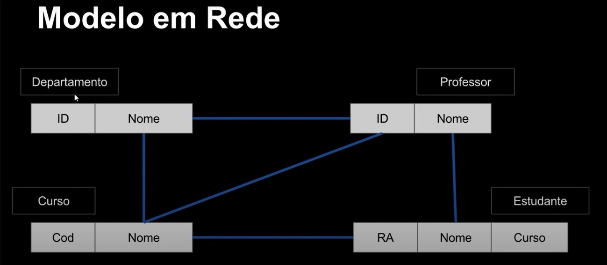

# Modelagem de dados

- **Processo crucial no projeto de um banco de dados.**
- Modelagem de dados é o processo de criação de um modelo de dados para um sistema de informação, com a aplicação de técnicas específicas de modelagem.
- Trata-se de processos para definir e analisar requisitos de dados necessários para suportar processos de negócio com sistemas informatizados em organizações.
- Um modelo de dados fornece uma estrutura para os dados usados em um SI (Sistema de Informação), com definições e formatos específicos
- Permite determinar as tabelas com seus atributos e relacionamentos que comporão o BD (Banco de Dados).
- Elimina redundâncias e dados sem interesse.
- Aplicar regras de negócios de acordo com a real necessidade do cliente.
- Evita problemas futuros com retrabalho e eventual perda de dados.

## Modelos

- Um modelo é uma estrutura que ajuda a comunicar os conceitos que estão na mente do projetista. Podemos usá-lo para tarefas como descrever, analisar, especificar e comunicar ideias.
- O modelo deve possuir detalhes suficientes para que um desenvolvedor consiga construir o banco de dados de acordo com a necessidade do projeto.

### Modelos de Dados

- É uma coleção de ferramentas conceituais para a descrição de dados, relacionamentos, semântica de dados e restrições de consistência.
- Divido em duas formar:
  - **Conceitual**:
    - Entidade-Relacionamento (ER);
    - Orientado a Objetos (OO);
  - **Lógicos**:
    - Redes;        // Modelos antigos
    - Hierárquicos; // dificilmente são utilizados.
    - Orientado a Objetos.
    - *Relacional* - diferente dos outros modelos, ele não usa ponteiros ou ligações, e relaciona registros a partir de valores do registro.
    - Não-Relacional

### Modelos antigos

- **Modelo Hierárquico**: Uma das primeiras formas foi criada pela IBM, onde os dados eram modelados de maneira bem simplista. Neste modelo os dados são organizados de forma hierárquica (lembrando muito um organigrama), com conjuntos de tipos de registros interconectados por meio de ligações.
Um ligação representa uma relação entre dois tipos de registros: pai e filho.
Um esquema no modelo hierárquico é um diagrama de estrutura de árvore.
O acesso aos dados é sempre unidirecional, a partir do pai ao filho.

- **Modelo em Rede**: Uma evolução do hierárquico, onde os dados não teriam superioridade ou inferioridade entre si(ou seja, não tem restrição hierárquica), eles eram ligados em uma forma de rede inteligente.Neste modelo os dados são organizados em tipos e ligações entre dois registros. Tanto o esquema quanto ocorrências de dados são visualizados como um grafo direcionado.

### Modelos atuais

- Apesar de funcionais, os modelos antigos não facilitavam uma coisa que precisaria ser simples, o  **relacionamento**, onde os registros de uma tabela poderiam ter relação com registro de outra tabela, criando assim uma relação entre os dados. Foi então que em junho de 1970, um dos pesquisadores da IBM chamado Edgar F. Codd em um artigo intitulado [A Relational Model of Data for Large Shared Data Banks](https://www.seas.upenn.edu/~zives/03f/cis550/codd.pdf) (Um modelo relacional de dados para grandes bancos de dados compartilhados) propôs um novo modelo:

- **Modelo Relacional**: Nesse novo paradigma, em vez de hierarquias ou ligações de redes, eles teriam relações mais intrínsecas, eles teriam uma **relação**. Ele é fundamentado em lógica e no paradigma da teoria de conjuntos. Neste modelo os dados são separados em entidades, conforme cada assunto, e registrados como atributos dessas entidades. As entidades se relacionam entre si e permitem que os dados sejam armazenados e recuperados de forma rápida e segura.
- No modelo relacional os dados são organizados em coleções de tabelas bidimensionais. Essas tabelas são também chamadas de "relações". A relação é uma forma de se organizar os dados em linhas e colunas.
- Ele é o mais utilizado ultimamente, muito também devido a fácil didática. Os bancos relacionais são a opção ideal para sistemas ERP, CRM ou de gerenciamento financeiro, em que é necessária uma grande consistência de dados.

- *Componentes do Modelo Relacional*:
  - Coleções de objetos ou relações que armazenam os dados;
  - Um conjunto de operadores(comandos) que agem nas relações, produzindo outras relações.
  - Integridade de dados, para precisão e consistência.
-*Banco de dados Relacional*:
  - Nasce a partir do modelo relacional. É uma coleção de relações, que são tabelas bidimensionais, onde os dados são armazenados.
-*Componentes de um banco de dados Relacional*:
  - **Tabela**: Estrutura básica de armazenamento no SGBDR. Armazena todos sos dados necessários sobre algo do mundo real. Também chamada de **Relação**. Um banco de dados relacional pode conter uma ou mais Tabelas. Elas são o resultado do cruzamento de linhas e colunas, sendo assim uma coleção de **linhas (registros)** em um banco de dados relacional, que armazena dados referentes a uma **entidade (assunto)** em particular.  
  - **Tupla**: É um conceito/termo bem especifico no mundo dos bancos de dados, que se refere basicamente a uma **Linha/Registro**, representa todos os dados requeridos por uma determinada ocorrência de entidade em particular ou seja, trata-se de um conjunto de valores de colunas relacionados. Cada linha em uma tabela deve ser identificada por uma chave primária, de modo a não haver duplicação de registros.  
  - **Coluna**: Domínio de valores de um tipo específico (definição técnica). Unidade que armazena um tipo especifico de dado (valor) - ou não armazena nada, com valor nulo. Esta é uma *coluna não-chave* significando que seu valor pode se repetir em outras linhas da tabela. Basicamente seria uma informação que você quer armazenar no banco de dados. As colunas irão fazer a discrição dos atributos da tabela; Dependendo do estágio da modelagem também é conhecida como *Atributo*.  
  - **Relacionamento**: Associação entre as entidades (tabelas), conectadas por chaves primárias e chaves estrangeiras;  
  - **Índices**: - Estrutura de dados empregada para **otimizar a seleção de um conjunto específico de colunas** em um banco de dados relacional. Uma das ferramentas de otimização mais conhecidas e utilizadas pelos desenvolvedores de bancos de dados. Indexação em tabelas **pode aumentar significativamente a performance em consultas** ao banco de dados. Porém, **pode diminuir a velocidade de transações** como *inserts* e *updates*.
  - **Stored Procedures SP**: (Procedimentos Armazenados) São um conjunto de declarações SQL armazenadas no servidor.Eles são utilizados quando:
    - Aplicações clientes são escritas em diferentes linguagens ou trabalham em diferentes plataformas, mas precisam executar as mesas operações de banco de dados;
    - Segurança é primordial. Bancos, por exemplo, utilizam funções e procedimentos armazenados para tordas as operações comuns. Isso provê consistência e segurança, pois cada operação é devidamente registrada.
    - Rotinas armazenadas podem fornecer melhor desempenho pois menos informações precisam ser enviadas entre o cliente e o servidor;
    - A desvantagem é que aumenta-se a carga no servidor de banco de dados;
    - Permitem a criação de uma biblioteca de funções no servidor de banco de dados;  
  - **Triggers**: (Gatilhos) É um objeto do banco de dados que está associado a uma tabela, e é ativado quando um evento particular ocorre na tabela; Principais usos são:
    - Executar verificações de valores; ou
    - Fazer cálculos sobre os valores informados em uma atualização;
  Ele é ativado quando uma declaração INSERT, UPDATE ou DELETE ocorre na tabela associada; O disparo do "gatilho" pode ser configurado para ocorrer antes ou depois do evento de disparo.  

- Esse modelo é interessante pois através de um dado eu posso obter outras informações que estejam relacionadas, desde que esse dado seja bem especificado, diferenciando dos modelos antigos.

> Porém atualmente não há apenas modelos relacionais, existem outras formas de se modelar dados, e cada uma atende uma necessidade, alguns exemplos são:

- **Modelo baseado em Documentos**: É um tipo de banco de dados não relacional projetado para armazenar e consultar dados como documentos do tipo JSON. Ele facilita para que os desenvolvedores armazenem e consultem dados usando o mesmo formato de modelo de documento que usam no código do aplicativo. Devido a sua estrutura ele é capaz de evoluir conforme as necessidades dos aplicativos.

- **Modelo Orientado a Objeto (BDOO)**: Armazenar objetos compartilhados entre diferentes aplicações. Estes meios de armazenamento se tornaram conhecidos com o crescente uso de linguagens Orientada a Objetos. Esse modelo parte de uma premissa simples: o que se persiste são os objetos e, portanto, o seu “estado”, representado pelos atributos. Os atributos seriam equivalentes aos campos – ou colunas – de uma tabela. Já as associações entre objetos (atributos que referenciam outros objetos) podem ser comparadas aos relacionamentos, criados como restrições de integridade referencial (“chaves estrangeiras”). Assim, o correspondente a uma “tabela-filha” em um BDOO seria um atributo que tenha como valor outro objeto.

## Análise de requisitos

- Nesta fase, são realizadas reuniões para coleta de informações, que analisam o que é exigido para o banco de dados a ser criado.
- Os processos de negócio são definidos, e as entidades, atributos e relacionamentos do BD são documentadas.
- A Análise é extremamente importante para o sucesso do projeto do BD.

## MER / ERM

- **Modelo Entidade-Relacionamento / Entity–Relationship Model**
- Criado pelo Dr. Peter Chen, em 1976.
- Trata-se de um modelo conceitual usado para descrever objetos envolvidos no domínio de um sistema a ser construído, incluindo seus atributos e relacionamentos. O MER permite representar de forma abstrata a estrutura que irá construir o banco de dados.
- São diagramas utilizados para projetar Bancos de Dados Relacionais, utilizando como base a relação de objetos reais, e sendo representado por meio de **entidades** e relacionamentos. Criados a partir das especificações do negócio ou narrativas do usuário. Nele ilustramos como os dados são estruturados nos processo de negócios ou para detalhar como os dados são armazenados nos bancos de dados relacionais, além de ilustrar as entidades em um negócio e também relacionamentos entre elas.
Construímos o MER durante a fase de análise no ciclo de vida de desenvolvimento do sistema.
Um MER separa a informação necessária ao negócio das atividades que são realizada no negócio, ou seja, num exemplo de uma loja, o MER irá me auxiliar a saber quais serão os dados serão armazenados das vendas, da loja e do cliente e como esses itens irão se relacionar. Esse modelo é posteriormente refinado com o uso de técnicas específicas, e finalmente implementado em um banco de dados físico.
- Um modelo entidade relacionamento é uma maneira sistemática de descrever e definir um processo de negócio. O processo é modelado como componentes (entidades) que são ligadas umas às outras por relacionamentos que indicam as dependências entre elas.
As entidades podem ter várias propriedades (atributos) que se caracterizam.
Diagramas são criados para representar graficamente entidades, atributos e relacionamentos, denominados Diagrama Entidade-Relacionamento (DER).
- **Modelo** ER (MER): Lista de entidades, atributos e relacionamentos, que traz informações sobre tipos de dados, restrições, descrições de entidades e outras.
- **Diagrama** ER (DER) Representação gráfica associada ao MER (ou parte dele).

### Entidades

As entidades representam um objeto do mundo real e que possuem uma existência independente, como: pessoas, empresa, carro, casa, entre outras coisas que podem ser representadas por uma entidade. Seria algo de importância para um usuário ou organização, algo significativo, sobre o qual devemos possuir informações e que precisa ser representado em um banco de Dados.
Representa um tem, tópico ou conceito de negócio.
Uma entidade pode ter existência física ou abstrata.
Nomeamos as entidades usando substantivos que presentam de forma clara e objetiva sua função.

Cada objeto/ocorrência de uma entidade é denominado de:

**Instância de Entidade**: Uma entidade em si é um descrição da estrutura e forma das ocorrências da entidade, como uma "Receita", ou "planta".
Uma instância de entidade é uma ocorrência específica de uma entidade;

**Regras de Nomeação (Boas práticas)**:

- Colocar os nomes das entidades no singular, mesmo que ela represente varias ocorrências;
- Devem começar com uma letra;
- Não podem ter espaços ou alguns caracteres especiais;
- Os caracteres permitidos são ($, #, _)
- Os nomes de colunas devem ser únicos dentro de uma tabela;
- Os nomes de entidades/  tabelas devem ser únicos dentro do esquema;

Ex: Cliente, Empregado, Livro, Venda, Produto;

Existem três tipos de entidades:

- **Fortes**: Não dependem de outras entidades para existirem;
- **Fracas**: Dependem de outras entidades para existir, ou seja, elas não possuem existência própria ou não possuem atributos próprios para identificação, dependendo assim, dos atributos chave das entidades fortes;
- **Associativas**: são utilizadas quando existe a necessidade de associar uma entidade a um relacionamento;

### Atributos

Os atributos descrevem as propriedades/características das entidades. A entidade pessoa pode ter como atributo o nome, data de nascimento, idade, endereço. Seria algo que descreve ou qualifica uma entidade, com eles podendo ser obrigatórios ou não. Os atributos possuem um tipo de dados (domínio) nome e valor específico. Ex. telefone do cliente, endereço do cliente. Podem ser chamados também de **campos** ou **colunas**. Existem 5 tipos de atributos:

- **Simples/ Atômico**: São indivisíveis, ou seja, são atributos atômicos, que não possuem características especiais. Um exemplo seria o atributo CPF, ele não pode ser dividido em partes menores para formar outros atributos, ele é indivisível.
- **Composto**: Podem ser divididos em partes menores, que representam outros atributos, como o atributo endereço, ele pode ser subdividido em atributos menores, como cidade, estado, rua, CEP. Por esse motivo, não é ideal armazenar o atributo composto inteiro, pois isso dificultará ao se fazer buscas especificais;
- **Multivalorado**: Pode ter um ou N (vários) valores associados a ele, ou seja, conter mais de um valor para um mesmo registro. Por exemplo, o atributo telefone de um cliente, pois o cliente pode ter vários telefones.
- **Derivado**: Dependem de outro atributo ou até mesmo outra entidade para existir, como, por exemplo, o atributo idade e o atributo data de nascimento, para descobrimos a idade de uma pessoa precisamos da sua data de nascimento, então, consideramos o atributo idade como derivado do atributo data de nascimento. No diagrama o Multivalorado **recebe um * antes do seu nome**
- **Determinante**: É utilizado para identificar de forma única uma entidade, ou seja, os valores associados a esse atributo são distintos dentre o conjunto de entidades. Como exemplo, podemos utilizar o CPF de uma pessoa, ele é único e pode ser utilizado como atributo determinante, já que cada pessoa recebe um número de CPF distinto (PK - Primary Key). No diagrama entidade-relacionamento costumamos deixar o **atributo determinante sublinhado**.
- **Identificador**: Identifica uma instância específica na classe de entidade;  Se diferenciam dos determinantes pois podem ser repetidos dependendo da situação. Esses atributos podem ser:
  - *Únicos*: O valor dos dados da chave é único na entidade;
  - *Não-única* - Usada para agrupar instâncias de classe em categorias (FK - Foreign Key).
  - *Compostas* - As chaves podem ser compostas, consistindo de dois ou mais atributos combinados.
- **Chave** - Um atributo-chave é um que é uma PK ou parte de uma PK composta;

### Relacionamento

Ligação entre dois atributos, de duas ou mais tabelas.
As entidades podem ser conectadas entre si por meio de Relacionamentos. Trata-se de uma estrutura que indica a associação de elementos de uma ou mais entidades.
São o relacionamento entre entidades, criando assim uma associação, que normalmente são representados por verbos. Essa relação é um conjunto de registros (tuplas) que representam um modelo de uma entidade. Cada registro representa uma instância de entidade, e o conjunto de todas as instâncias, com seus atributos, é chamado de Relação.
Também conhecida com uma tabela bidimensional com características específicas, composta por linhas e colunas, criada a partir de uma entidade.
Exemplo: "uma pessoa trabalha para uma empresa". Seria uma associação nomeada entre entidades, com um grau de associação. Ex: O cliente pode estar associado a um pedido.

- Características de uma relação:
  - Linhas contém dados sobre instâncias de uma entidade (registros);
  - Colunas contém dados sobre atributos da entidade (campos)
  - Cada célula (onde são escritos os dados) da tabela armazena um único valor;
  - Todos os valores e uma coluna são do mesmo tipo (domínio dos dados);
  - Não há duas linhas idênticas;
  - As relações geralmente geram tabelas no banco;

> Toda relação é uma tabela, mas nem toda tabela é uma relação.

**Porque precisamos de relacionamentos?**

- Como os dados de diferentes entidades são armazenados em tabelas distintas, geralmente precisamos combinar duas ou mais tabelas para responder ás perguntas específicas de usuários. Por exemplo, podemos querer saber quais produtos, e em qual quantidade, foram adquiridos por um cliente em particular, Precisamos então de dados das tabelas de clientes, de pedidos e de produtos para obter essa informação.

## Relação Aninhada

- Significa uma tabela dentro de outra tabela, que seria quando a tabela tem um conjunto de atributos/colunas que em si formam outra tabela, com dados que não precisariam estar nessa tabela.

### Grau de um relacionamento

- **Forte** - Onde uma entidade depende de outra para existir; A existência de uma entidade filha é depende de uma entidade-pai; A chave primária da entidade-filha contém a chave primária da entidade-pai; Se a entidade pai não existir, a entidade filha desaparece;
- **Fraco** - A existência de uma entidade é independente de outras entidades; A chave primária de uma entidade-filha não contém a chave primária da entidade-pai;

- Define o número de entidades que participam do relacionamento, podendo ser (sucessivamente):
  - **Unário** - Quando uma entidade se relaciona com ela mesma.
    
  - **Binário** - Quando há relacionamento entre duas entidades, é o caso mais comum.
    
  - **Ternário** - Quando há relacionamento entre três entidades;
  

- Cada linha de dados em uma tabela deve ser identificada de forma única usando-se uma **Chave Primária** (identificador exclusivo).
- Usamos uma **Chave Estrangeira** para relacionar os dados entre múltiplas tabelas.
- Usamos para isso o relacionamento entre chave primária de uma tabela com a chave estrangeira de outras tabelas.

### Cardinalidade

- Conceito que diz respeito ao número de itens que se relacionam nas entidades.
- Pode ser máxima ou mínima, significando respectivamente os números mínimos e máximo de instância de cada entidade associada no relacionamento.
- *Máxima*: Trata-se do número máximo de instâncias de entidade que podem participar em um relacionamento. Pode ser 1 ou N (muitos);
- *Mínima*: Número mínimo de instâncias de entidade que DEVEM obrigatoriamente participar em um relacionamento; 0 é participação opcional e 1 é obrigatória.
- Representação de Peter Chen:
  - **(1,1)** - O primeiro número representa a cardinalidade minima, e o segundo a máxima. Porém, dependendo da situação pode haver apenas um número, indicando que esse valor serve tanto para a minima como para a máxima; Os parenteses não são obrigatórios, porém é uma boa prática;
  - Outros exemplos:
  
  
- Expressa o número de entidades que a outra entidade pode ser associada, sendo classificada por 3 tipos:
  - *UM PARA UM (1:1)*: Onde uma entidade X se associa unicamente a uma ocorrência da entidade Y; (EX: Time - Técnico); Uma instância de entidade única em uma entidade está relacionada com uma instância de entidade única de outra entidade;
  - *UM PARA MUITOS (1:N - N:1)*: Onde uma entidade X se associa a várias ocorrências da entidade Y, porém, a entidade Y pode apenas se associar a uma ocorrência da entidade X; (EX: Cliente - Carro); Um instância de entidade única em uma classe de entidade está relacionada a muitas instâncias de entidade em outra classe de entidade.
  - *MUITOS PARA MUITOS (N:M)*: Onde a entidade X o pode se associar a várias ocorrências da entidade Y e a entidade Y pode também se associar a várias ocorrências da entidade X; (EX: Paciente - Médico); Muitas instâncias em uma entidade estão relacionadas a muitas instâncias de entidade em outra entidade. Por ser muito difícil de se aplicar no banco de dados, o ideal é desmembrar esse relacionamento criando outra entidade e transformar ele em um relacionamento 1:N ou 1:1;

  

## Chaves

- Uma chave consiste em uma ou mais colunas de uma relação cujos valores são usados para identificar de forma exclusiva uma linha ou conjunto de linha.
- Pode ser **única** (identifica uma única linha) ou **não-única** (identifica um conjunto de linhas).
- Uma ou mais colunas de uma relação cujos valores são usados para identificar de forma exclusiva uma linha ou conjunto de linhas.
- **Únicas (Unique):**
  - *Candidata / Alternativa* - Atributo ou grupo de atributos com potencial para se tornarem uma chave; Uma chave candidata que não seja usada como chave primária será conhecida como **Chave Alternativa**.
  -*Substituta (Surrogada - Surrogate)* - Valor numérico, único, adicionado a uma relação para servir como chave primária; Não possui significado para os usuários e geralmente fica escondida nas aplicações; São frequentemente usadas no lugar de uma chave primária composta;
  - *Composta* - Chave que é composta de dois ou mais atributos (colunas); Geralmente empregada quando não é possível utilizar uma única coluna de um tabela para identificar de forma exclusiva seus registros.
  - *Primária*: **(PK - Primary Key)** É uma chave candidata escolhida para ser a **chave principal** na relação; Identifica de forma **exclusiva** os registros em uma tabela, não podendo ter repetição de valores nem tampouco valor nulo.
- **Não-Única (Non-Unique)**:
  - *Estrangeira*: **(FK - Foreign Key)** Coluna de uma tabela que estabelece um **relacionamento com a Chave Primária (PK) de outra tabela; É a partir da chave estrangeira que sabemos com qual registro em outra tabela um registro está relacionado.

### Chave Primária (PK - Primary Key)

- Coluna (atributo) que identifica um registro de forma exclusiva na tabela. Por exemplo, o CPF de um cliente, contendo um valor que não se repete na relação;

### Chave estrangeira (FK - Foreign Key)

- Coluna que define como as tabelas se relacionam umas com as outras. Uma FK se refere a uma OK ou a uma chave única em outra tabela (ou na mesma tabela). Por exemplo, na tabela de pedidos, podemos ter uma chave estrangeira efetuando o relacionamento com a chave primária na tabela clientes.

### Instruções para criação de PK e FK

- Não é possível haver valores duplicados em uma chave primária;
- No geral, não é possível alterar o valor de uma chave primária.
- Chaves estrangeiras são baseadas em valores de dados, classificadas como ponteiros lógicos;
- Um valor de uma chave estrangeira deve corresponder a um valor existente em uma chave primária associada (ou valor de chave única). Caso contrário, deve ser nulo (NULL);
- Uma chave estrangeira deve referenciar uma chave primária ou uma coluna de chave única;

### Conceito de Domínios / Data Types

- Definir tipos de dados;
- Especificar valores válidos em um campo;
- Cada SGBD tem independencia para criar seus próprios data types, porém os tipos padrões são respeitados:
  - Integer (int)
  - Char
  - Long
  - Float
  - DateTime
  - Binary

- No caso do SQL Server, ele tem tipos de dados para tratar XML e imagens também.

## Diagramação

- O uso de um diagrama facilita a modelagem e a comunicação entre os membros da equipe de desenvolvimento, permitindo que todos falem a mesma "lingua" durante o processo.
- Existem vários métodos para representar relacionamentos entre entidades.
- As notações gráficas mais utilizadas em modelagem de dados são:
  - IDEF1X
  - Bachman
  - Min-Max
  - Pé de Galinha (Crow's Foot)
  - Martin
  - UML
  - Peter Chen

  

- **Softwares para Diagramação**
  - Ferramentas CASE (Computer-Aided Software Engineering - Engenharia de software com auxilio de computador)
    - Astah
    - Lucidchart
    - erwin Data Modeler
    - ERDPlus
    - GenMyModel
    - Star UML
    - Microsoft Vision
    - MySQL Workbench
    - Visual Paradigm

## DER / ERD

- **Diagrama Entidade-Relacionamento / Entity–Relationship Model**
- Diagrama de modelagem de dados que **permite visualizar a interação entre entidades (tabelas), atributos (colunas) e seus relacionamentos.**
- Derivador do MER, foi proposto por Peter Chen para representação gráfica do que foi escrito no MER, ele ajuda no processo de implementação do BD, sendo um artefato importante para a criação de um modelo físico. Por estarem tão vinculados, muitas vezes são tratados até como sinônimos.
- Pode ser criado com ferramentas específicas como **ERWin, Astah, Visual Paradigm, LucidChart** ou mesmo "na unha".
- Em sua representação ele pode ter:
  - *Retângulo* = Entidade;
  - *Losango* = Relacionamento;
  - *Elipse* = atributo, porém podemos representa-lo também apenas pelo nome, sem a elipse;
  - *Linhas* = Ligam atributos a entidades e entidades a relacionamentos;
  - *Linhas duplas* = ;
  - *Retângulos duplos*= ;
  - *Elipse dupla* = atributo que pode ocorrer mais de uma vez no banco de dados (multivalorado);
  - *subatributos* = ;
  - *Triângulos* = ;

## Convenções para modelagem de entidades, relacionamentos e atributos

Não são regras gerais ou obrigatórios, porém é legal conhece-los pois são muito comuns de ser usados:

- **Entidades**: Nome único, singular; em caixa alta (Maiúsculos);
- **Atributos**: nome no singular; caixa baixa(minusculo); Atributos obrigatórios marcados com *; identificador único marcado com #;
- **Relacionamentos**: nome identificador (verbo); opcionalidade ("deve ser" ou "pode ser"); grau ou carnalidade;

## Identificador Único (UID)

- Um identificador único é qualquer combinação de atributos ou relacionamentos que são usados para distinguir ocorrências de uma entidade. Cada ocorrência da entidade deve ser identificável de forma exclusiva.

## Níveis / Abstração de Dados

- Pode ser divido em 3 partes:

### Nível físico (baixo nível) - MFD

- Nível de abstração mais baixo, descreve como os dados são armazenados. Esta é a primeira fase da modelagem, onde representaremos o mundo real por meio de uma visão simplificada dos dados e seus relacionamentos. Assim poderemos determinar quais informações serão armazenadas no BD. Neste nível o projeto é independente de SGBD.
Ex:
Cadastro de produtos em uma loja
Dados necessários: nome do produto, categoria de produto (limpeza, higiene, etc) código do fornecedor, tipo de embalagem, tamanho , quantidade.
- Neste nível, detalhes da implementação não aparecem, porém é suficientemente detalhado para a ponto de ser possível descrever os tipos de dados requeridos, seus relacionamentos entre si e regras de consistência.

### Nível lógico - MLD

- O próximo nível de abstração, descreve quais dados estão armazenados no banco de dados e quais relações existem entre eles. Um modelo lógico possui conceitos que os usuários são capazes de entender, ao mesmo tempo que não está distante do modelo físico do banco de dados;
- Neste nível o projeto é independente de SGBD.
- Consiste na especificação lógica dos dados em um formato adequado ao SGBD escolhido. Os tipos de dados são completamente definidos.

### Nível de visão/ conceitual (alto nível) - MCD

- A abstração mais alta, descreve apenas parte do banco de dados. A partir de um modelo lógico nós derivamos o modelo físico, onde se detalham os componentes de estrutura física do banco de dados, incluindo as tabelas, campos, tipos de valores, restrições, etc.
- Ao criarmos o modelo físico, poderemos partir para a implementação física do banco de dados, utilizando o SGBD mais adequado.
- Geralmente nessa parte você já consegue identificar qual seria o melhor sistema de gerenciamento usar.

## Arquitetura de Três Níveis

## Esquema(Schema) do Banco de Dados

- Um esquema é uma definição do banco de dados especificada durante o projeto, armazenada no *Dicionário de dados*;
- Um esquema raramente muda durante a vido do BD.
- Trata-se da organização dos dados em um plano que mostra como o banco é construído.
- O esquema define tabelas, campos, relacionamentos, visões, funções e muitos outros elementos que compõem o BD.

## Etapas do desenvolvimento de um BD

As principais etapas no desenvolvimento de um BD são:

1. Especificação e Análise de Requisitos
   1. Os requisitos são documentados
2. Projeto conceitual
   1. Baseado nos Requisitos
3. Projeto Lógico
   1. Expresso em um modelo de dados, como o Relacional
4. Projeto Físico
   1. Especificações para armazenar e acessar o banco de dados.
   2. Implementação do BD, inserção de dados reais e manutenção.

### Tarefas para Modelagem

- As tarefas a seguir devem ser realizadas para que seja possível efetuar modelagem de dados e projeto de BD funcional:
  - Identificar os tipos de Entidades
  - Identificar atributos
  - Identificar Relacionamentos
  - Criar associar chaves
  - Normalizar para reduzir a redundâncias
  - Desnormalizar para aumentar performance.

## Integridade de Dados para

- Manutenção e garantia da consistência e precisão dos dados, sendo um aspecto crítico no design, implementação e uso de sistemas de armazenamento de dados; A integridade é atingida por meio da aplicação de:

- **Restrições de Integridade**:
  -*Integridade Referencial*: Assegura que valores de uma coluna em uma tabela são válidos baseados nos valores em uma outra tabela relacionada.
  - Atualização e Exclusão:
    - Se um registro for excluído em uma tabela, então os registros relacionados em outras tabelas que o referenciam talvez precisem ser excluídos; Caso contrário ocorrerá erro. O mesmo se dá com atualização de registros;
  -*Integridade de Domínio*: Valores inseridos em uma coluna devem sempre obedecer à definição dos valores que são permitidos para essa conta - os valores do domínio. Ex: em uma coluna que armazena preços de mercadorias, os valores admitidos são do domínio - ou seja, apenas números.
  - Fatores:
    -Tipo de dado do campo;
    - Representação interna do tipo de dado;
    - Presença ou não do dado;
    - Intervalos de valores no domínio;
    - Conjuntos de valores discretos;
  -*Integridade de Vazio*: Este tipo de integridade informa se a a coluna é obrigatória ou opcional - ou seja, se é possível não inserir um valor na coluna; Uma coluna de chave primária, por exemplo, sempre deve ter dados inseridos, e nunca pode estar vazia, para nenhum registro.
    - **Valores Nulos (NULL)**: Um valor NULL significa que não existem dados. É diferente de zero, espaço, string vazia ou tabulação; Os nulos podem ser problemáticos, pois indicam:
      - O valor da coluna não é apropriado;
      - O valor não foi inserido;
      - O valor é desconhecido;
  -*Integridade de Chave*: Os valores inseridos na coluna de chave primária devem ser únicos, não admitindo-se repetições nesse valores; Dessa forma, as tuplas serão sempre distintas; Os valores de chave primária também não podem ser nulos.
  -*Integridade Definida pelo Usuário*: Diz respeito a regras de negócio específicas que são definidas pelo usuário do banco de dados; Por exemplo, pode-se definir que uma coluna somente aceitará um conjunto restrito de valores;

## Dicionário de Dados

- Um dicionário de dados é um documento usado para armazenar informações sobre o conteúdo, formato e a estrutura de um banco de dados, assim como os relacionamentos entre os seus elementos.
- É importante manter um dicionário de dados para limitar erros ao criar a estrutura física do banco de dados no computador;
- Também chamado de **Repositório de Metadados**.

### Metadados

- Definimos metadados como sendo "Dados sobre os dados";
- Permitem efetuar a representação e identificação dos dados, garantindo sua consistência e persistência;
- Os Metadados são mantidos no Dicionário de Dados (ou em um Catálogo de Dados)

> Entidades

> Atributos

> Relacionamento

## Dependências

- A ideia de dependência é justamente estabelecer uma relação entre os atributos de uma tabela.

### Dependência Funcional

- Dependência mais comum.
- Seja E um entidade, e X  Y dois atributos quaisquer de E. Dizemos que Y é funcionalmente dependente de X se e somente se cada valor de X tiver associado a ele exatamente um valor de Y.
Simbolicamente:  

- *X --> Y*

Que lemos como **"X determina funcionalmente Y"**, ou, **Y depende funcionalmente de X**.  

Ex.: O prazo de entrega de um pedido depende do número do pedido considerado:

- *Numero_Pedido --> Prazo_Entrega_Pedido*

O atributo que determina o valor é chamado de **Determinante**. O outro é chamado de **Dependente**.
Uma chave primária em uma relação determina funcionalmente todos os outros atributos não-chave na linha.

- **Tipos de Dependências Funcionais**:
  - *Total* - Em uma relação com um PK composta, um atributo não-chave que dependa dessa PK como um todo, e não somente de parte dela, é dito como possuindo **Dependência Funcional Total**.
  - *Parcial* - É parcial quando os atributos não-chave não dependem funcionalmente de toda a PK quando esta for composta. Ou seja, existe uma dependência funcional, mas somente de uma parte da chave primária.
  - *Transitiva* - Ocorre quando um campo não depende diretamente da chave primária da tabela (nem mesmo parcialmente), mas depende de um outro campo não-chave. Em outras palavras, o atributo não deveria estar nessa tabela, e sim em outra e a partir disse criar o relacionamento.
  - *Multivalorada* - Ocorre quando, para cada valor de um atributo A, existe um conjunto de valores para outros atributos B e C que estão associados a ele, mas não independentes entre si. Representamos a dependência multivalorada assim:

  - *A ->> B*

  Onde B é a coluna que depende de A. Durante o processo de normalização é comum se criar novas tabelas a partir da dependência valorada para não haver tantas repetições.
  - *Trivial* - Dependência que não pode deixar de ser satisfeita. Uma DF é trivial se o lado direito da expressão é um subconjunto da lado esquerdo.

  - *A --> B* é uma DF trivial se B for um subconjunto de A.
  Exemplo:
  {ID_Func, Nome_Func} --> ID_Func é uma DF trivial porque ID_Func é um subconjunto de {ID_Func, Nome_Func}

## Normalização

- Normalização consiste em um processo de análise de uma relação para assegurar que seja bem formada.
- **Decompor** relações com *anomalias* para produzir relações menores e bem-estruturadas. Ou seja, em uma relação normalizada podemos inserir, excluir ou modificar registros sem criar anomalias.
  - Decompor significa pegar uma tabela com vários campos e extrair os campos que não são relevantes para essa tabela, e assim formar outras tabelas com esses campos. Nenhum dado é perdido, apenas organizado de maneira correta.

- Esse processo foi proposto Edgar Frank Codd, em 1972, para aplicar a um esquema de relação uma série de *teste* para certificar que ele satisfaça uma **Forma NormaL (FN)**. Codd propôs originalmente 3 formas normais:

### 1ª FN

Definida historicamente para reprovar atributos multivalorados, compostos e suas combinações. O domínio de um atributo deve incluir apenas valores atômicos (indivisíveis), e o valor de qualquer atributo em uma tupla deve ser único valor do domínio desse atributo;
    - Uma tabela está na 1ª FN quando:
      - Somente possui *valores atômicos*;
      - Não há grupos de atributos repetidos (há apenas um dado por colunas nas linhas)
      - Existe uma chave primária;
      - Relação não possui *atributos multivalorados* ou *relações aninhadas*;
      - Uma tabela está na 1ª FN se somente houverem valores atômicos no domínio de seus atributos.
      - Cada informação deve ser colocada em um campo diferente;

### 2ª FN

Baseada no conceito de *Dependência Funcional Total*; Um esquema de relação R está na 2FN se cada atributo não-chave de R for total e funcionalmente dependente da PK de R; Para testar a 2FN, testamos as dependências funcionais cujos atributos fazem parte da chave primária. Caso a PK tenha um único atributo, esse teste não precisa ser aplicado.

- Um tabela está na 2FN se:
  - Está na 1FN;
    - Todos os atributos não-chave são funcionalmente dependentes de todas as partes da chave primária.
    - Não existem *dependências parciais*;
    - Caso contrário, deve-se gerar uma nova tabela com os dados.
    - Deve-se criar uma nova relação para cada chave PK ou combinação de atributos que forem **determinantes em uma dependência funcional**; Esse atributo será a PK na nova tabela; Mova os atributos não-chave dependentes desta PK para uma nova tabela.

### 3ª FN**

  Baseada no conceito de *Dependência Transitiva*; A relação não deve ter um atributo não-chave determinado funcionalmente por outro atributo não chave (ou conjunto); Não deve haver dependência transitiva de um atributo não-chave sobre a PK; Deve-se decompor e montar uma nova relação que inclua os atributos não-chave que determinam funcionalmente outros atributos não-chave.

- Uma tabela está na 3FN se:
  - Estiver na 2FN;
  - Não existirem *Dependências Transitivas*;
  - Nenhuma coluna não-chave depender de outra coluna não-chave;
- Para cada atributo (grupo) não-chave que for um determinante na relação, crie uma nova tabela; Esse atributo será a PK na nova relação; Mova então todos os atributos que são dependentes funcionalmente do atributo chave para a nova tabela. O atributo (PK na nova relação) fica também na tabela original, e servirá como uma chave estrangeira para associar as duas relações;

> Posteriormente a 3ª forma normal foi revisada e uma definição mais robusta foi proposta por Boyce e Codd, denominada Forma Normal de Boyce Codd (FNBC). Existem também as 4ª e 5ª FN, porém são raramente utilizadas.

- O ideal é alcançar sempre a 3ª FN ou a FNBC durante a normalização.
- Não é adequado normalizar apenas até a 1ª FN ou à 2ª FN, pois na verdade essas formas normais são usadas para se chegar à 3ª FN ou a FNBC, para garantir a boa formação das tabelas.

- **Passos da Normalização**

Tabela não normalizada --> Remover atributos multivalorados e compostos --> **1ªFN** --> Remover Dependências Parciais --> **2ª FN** --> Remover Dependências Transitivas --> **3ªFN**;

### FNBC - Forma Normal de Boyce-Codd

- A definição original da 3FN de Codd não lidava adequadamente com uma relação que:
  - Tivesse duas ou mais chaves candidatas;
  - Essas chaves candidatas fossem compostas;
  - Elas tivessem *superposição (atributos em comum)*;

Caso a combinação das condições acima não ocorra em uma tabela, basta aplicar a 3FN;
Uma relação está em NBC se e somente se os únicos determinantes são chaves candidatas.

- Cada relação na FNBC também está na 3FN, mas uma relação na 3FN não está necessariamente na FNBC (a maioria está);
- Quando uma tabela possui mais de uma chave candidata, podem ocorrer anomalias;
- Na FNBC as chaves candidatas não possuem dependências parciais por outros atributos;
- Uma relação R está na FNBC sempre que uma dependência funcional não-trivial X --> A se mantiver em R, assim X é a superchave de R.

- Para normalizar uma tabela até a FNBC devemos decompor a tabela com os passos a seguir:

  - Encontrar uma dependência funcional não-trivial X -- > Y que viole a condição de FNBC. X não deve ser uma superchave.
  - Dividir a tabela em duas: Uma com os atributos XY, ou seja, todos os atributos da dependência;
  - Outra com os atributos X juntamente com os atributos restante da tabela original.
  - Pode haver mais de uma decomposição válida na FNBC.

### Anomalias de atualização

- Anomalias são problemas que ocorrem em bancos de dados mal planejados e não-normalizados, geralmente ocorrendo por excesso de dados armazenados em uma mesma tabela.
- São causadas pelas dependências parciais transitivas.
- As anomalias de atualização são classificadas de:
  - **Inserção/Inclusão**: Não deve ser possível adicionar um dado a não ser que outro dado esteja disponível. Por exemplo, não deve ser permitido cadastrar um novo livro sem que um autor já esteja cadastrado.
  - **Exclusão**: Ao excluirmos um registro, dados referentes em outra tabela são excluídos. Por exemplo, se excluirmos um autor, os livros desse autor devem ser excluídos também;
  - **Modificação**: Ao alterar um dado em uma tabela, dados em outras tabelas precisam ser alterados, por exemplo, se o código de um autor for modificado, esse código deve ser modificado na tabela de autores e na de livros também, para manter o relacionamento entre livros e seus autores corretos;

- **Eliminar Anomalias** - Projetar os esquemas (estrutura da tabela) de relações no banco de dados de modo que nenhuma anomalia de inserção, exclusão ou modificação esteja presente nas relações. Para isso, usamos o processo de **Normalização**.

### Objetivos da normalização

- Analisar esquemas de relações (tabelas) como base em suas dependências funcionais e chaves primárias para:

1. Minimizar redundâncias;
2. Minimizar anomalias de inserção, exclusão e modificação;

- As relações são decompostas em esquemas de relação menores que atendem aos testes de forma normal.
