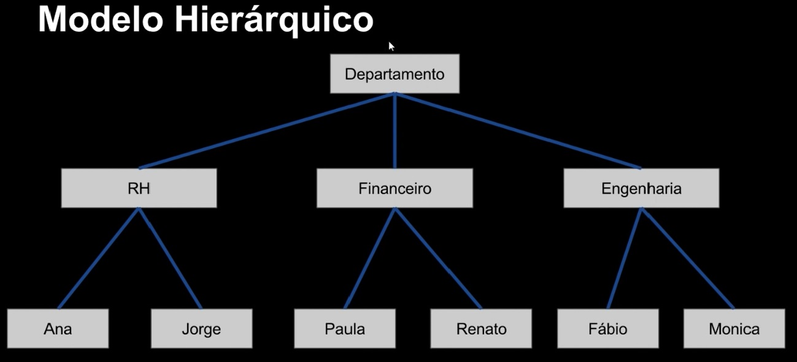

# Teoria sobre Banco de dados

## Estrutura

- Antigamente (final da década de 50) nossos dados eram armazenados em *papeis (fichas)*, segmentadas por *pastas* e armazenada em *armários de aço*. Hoje com a tecnologia não ficou tão diferente o conceito de se armazenar dados. Seguindo a mesma linha dos banco de dados antigos, hoje temos:
  - **Registros** (fichas);
  - **Tabelas** (pastas);
  - **Arquivos** (armários de aço);  
No contexto atual:
- **Arquivos** guardam as **Tabelas** que armazenam os **Registros**.

## Tipos de arquivos

- Devido a tecnologia de armazenamento da época (cartões perfurados, fitas magnéticas), a primeira digitalização dos dados eram feitas com **arquivos sequencias**, no qual era necessário conferir toda a base de dados de maneira sequência (ordem) para se fazer consultas. Apesar de lento, na época ainda era bem melhor que trabalhar com dados em papeis.
- Com o avanço da tecnologia de armazenamento (disco, disquetes, HDs), os arquivos começaram a ser analisados de maneira direta, e não mais sequencial, ou seja, não era mais necessário mais analisar todo o arquivo, agora poderia ser feito uma análise direta. Com isso os dados conseguiram ser armazenados em *tabelas* com *indices* (numerações) e guardar *chaves identificadoras* de cada *registro*, e assim tornando a análise extremamente mais rápido. Esses arquivos são chamados de **arquivos de acesso direto**. Mas ainda que fossem mais rápidos, os arquivos tinham indices muito simplistas.

## História

- Na década de 60 ocorreu um evento chamado *Codaysl*, onde houve um grande encontro de militares, empresas e universidades, tais como IBM e o departamento de defesa dos EUA . Lá foram discutidas grandes tecnologias emergentes da época, e uma delas foi o *COBOL*, a primeira linguagem que se preocupou efetivamente com a lógica da programação e como os dados embutidos nela, pois os dados eram primordiais para essa linguagem. Nesse evento surgiu os principais conceitos de **Banco de Dados**.
- O modelo criado foi dividido em 4 partes:
  - **Base de dados** - São todos os dados obtidos.
  - **Sistema gerenciador (SGBD ou DMS)** - Sistema gerenciador de banco de dados ou *Database Management System* é um software que gerencia todo o contexto dos dados.
  - **Linguagem de Exploração** - É a linguagem de acesso ao dado, necessário para a sua exploração.
  - **Programas adicionais** - Seriam utilidades como gerencia de usuário, otimizadores de dados entre outras coisas.

### Modelos antigos

- **Modelo Hierárquico**: Uma das primeiras formas foi criada pela IBM, onde os dados eram modelados de maneira bem simplista, porém totalmente de forma hierárquica.

- **Modelo em Rede**: Uma evolução do hierárquico, onde os dados não teriam superioridade ou inferioridade entre si, eles eram ligados em uma forma de rede inteligente.

### Modelos atuais

- Apesar de funcionais, os modelos antigos não facilitavam uma coisa que precisaria ser simples, o  **relacionamento**, onde os registros de uma tabela poderiam ter relação com registro de outra tabela, criando assim uma relação entre os dados. Foi então que na década de 70, um dos pesquisadores da IBM chamado Edgar F. Codd propôs um novo modelo:

- **Modelo Relacional**: Nesse novo paradigma, em vez de hierarquias ou ligações de redes, eles teriam relações mais intrínsecas, eles teriam uma **relação**. Ele é fundamentado no paradigma da orientação a conjuntos. Esse modelo é o mais utilizado ultimamente, muito também devido a fácil didática. Os bancos relacionais são a opção ideal para sistemas ERP, CRM ou de gerenciamento financeiro, em que é necessária uma grande consistência de dados.

- Esse modelo é interessante pois através de um dado eu posso obter outras informações que estejam relacionadas, desde que esse dado seja bem especificado, diferenciando dos modelos antigos.

> Porém atualmente não há apenas modelos relacionais, existem outras formas de se modelar dados, e cada uma atende uma necessidade, alguns exemplos são:

- **Modelo baseado em Documentos**: É um tipo de banco de dados não relacional projetado para armazenar e consultar dados como documentos do tipo JSON. Ele facilita para que os desenvolvedores armazenem e consultem dados usando o mesmo formato de modelo de documento que usam no código do aplicativo. Devido a sua estrutura ele é capaz de evoluir conforme as necessidades dos aplicativos.

- **Modelo Orientado a Objeto (BDOO)**: Armazenar objetos compartilhados entre diferentes aplicações. Estes meios de armazenamento se tornaram conhecidos com o crescente uso de linguagens Orientada a Objetos. Esse modelo parte de uma premissa simples: o que se persiste são os objetos e, portanto, o seu “estado”, representado pelos atributos. Os atributos seriam equivalentes aos campos – ou colunas – de uma tabela. Já as associações entre objetos (atributos que referenciam outros objetos) podem ser comparadas aos relacionamentos, criados como restrições de integridade referencial (“chaves estrangeiras”). Assim, o correspondente a uma “tabela-filha” em um BDOO seria um atributo que tenha como valor outro objeto.

## Referências

- O que é um banco de dados? - Curso em Vídeo - [https://youtu.be/Ofktsne-utM]
- O que é um banco de dados de documentos - Amazon Web Service - [https://aws.amazon.com/pt/nosql/document/]
- Bancos de Dados Orientados a Objetos - DevMedia - [https://www.devmedia.com.br/bancos-de-dados-orientados-a-objetos-sql-magazine-78/17717]
